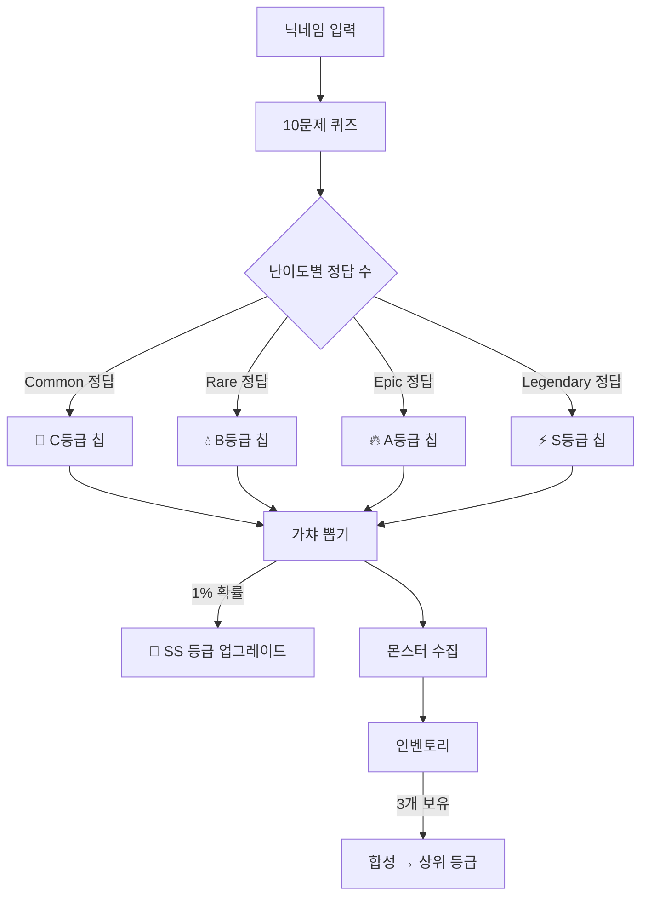
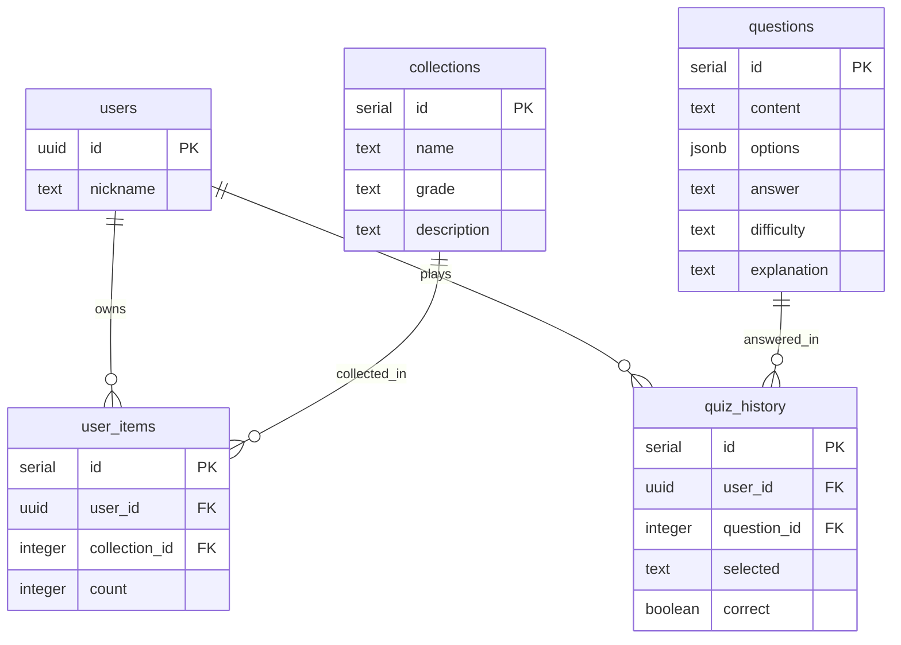
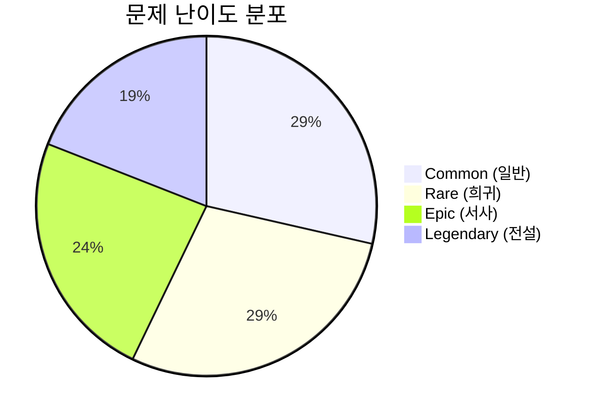

# Quizmon

AI·ML·DL 기술 퀴즈를 풀고 오리지널 AI 몬스터를 수집하는 게임형 웹사이트.

## 왜 만들었나

공부한 내용을 오래 기억하려면 단순히 읽는 것보다 퀴즈 형식이 효과적이다. 그런데 막상 ML 면접 준비를 할 때 쓸 만한 퀴즈 서비스가 없었다. 지식 점검과 게임적 재미를 동시에 잡을 수 없을까 고민하다가, 퀴즈 정답에 따라 AI 캐릭터를 뽑는 가챠 시스템을 떠올렸다. "오늘 맞힌 만큼 뽑는다"는 규칙이 생기면 매일 접속하는 이유가 생긴다.

## 어떻게 설계했나

닉네임만 입력하면 바로 시작할 수 있도록 인증을 없앴다. 회원가입 마찰 없이 핵심 경험(퀴즈 → 뽑기 → 수집)에 집중하게 하기 위해서다.

퀴즈는 난이도별로 문제를 뽑는다. Common 4문제, Rare 3문제, Epic 2문제, Legendary 1문제로 구성해 난이도가 점점 올라가는 흐름을 만들었다. 정답을 맞힐수록 더 높은 등급의 데이터 칩을 얻는다.



몬스터는 총 180종이다. C(75종)·B(45종)·A(30종)·S(20종)·SS(10종)로 등급이 올라갈수록 희귀하다. 3개를 모으면 합성해 한 단계 높은 등급으로 올릴 수 있다. 뽑기와 합성 두 가지 수집 경로를 만들어 단조로움을 줄였다.



## 주요 기능

퀴즈는 매 게임 선택지 순서가 랜덤 셔플된다. 정답이 항상 같은 위치에 있으면 패턴으로 외울 수 있기 때문이다. 문제 데이터베이스에 105개의 AI·ML·DL 면접 기출 수준 문제가 들어있다.

오답노트는 틀린 문제를 자동으로 저장한다. 정답·오답 이력이 쌓이면 정답률 통계와 함께 어떤 개념을 자주 틀리는지 파악할 수 있다.



## 스택

Next.js 16 (App Router) + TypeScript + Tailwind CSS + Supabase (PostgreSQL + RLS)

별도 백엔드 서버 없이 Supabase PostgREST API를 클라이언트에서 직접 호출한다. 모든 페이지는 SSG로 빌드되고 데이터 페칭은 클라이언트 사이드에서 처리한다.

## 로컬 실행

```bash
git clone https://github.com/forexms78/quizmon
cd quizmon
npm install
```

`.env.local` 생성:
```
NEXT_PUBLIC_SUPABASE_URL=your_supabase_url
NEXT_PUBLIC_SUPABASE_ANON_KEY=your_anon_key
```

```bash
npm run dev   # http://localhost:3000
```

Supabase 프로젝트는 `supabase/schema.sql`로 테이블을 생성하고, `supabase/seed-questions.sql`로 문제 데이터를 삽입한다.

## 데모

**https://quizmon-two.vercel.app**

## 버전 히스토리

| 버전 | 날짜 | 변경 내용 |
|------|------|----------|
| v1.3 | 2026-04-28 | 오답노트, 등급 아이콘, 하단 네비게이션, 문제 105개로 확장 |
| v1.2 | 2026-04-28 | Vercel 배포, Supabase 연동, 몬스터 180종·문제 40개 시드 |
| v1.1 | 2026-04-24 | 초기 구현 — 퀴즈·가챠·인벤토리·도감·합성 |
